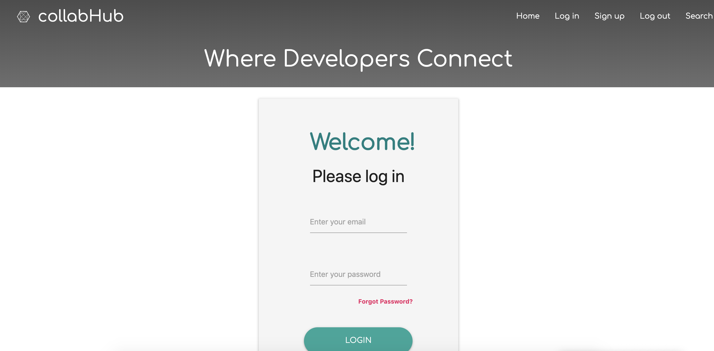
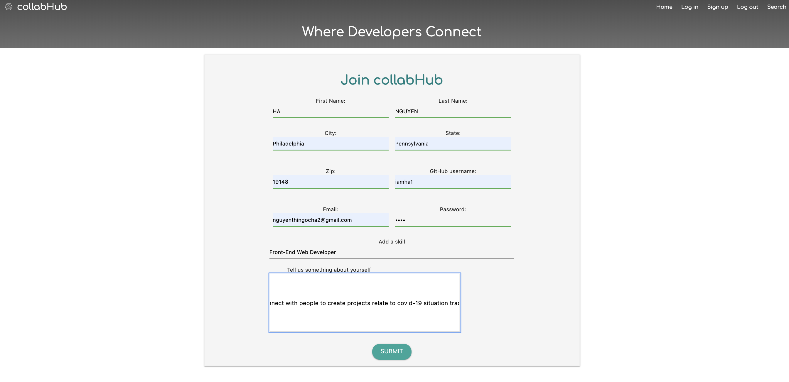
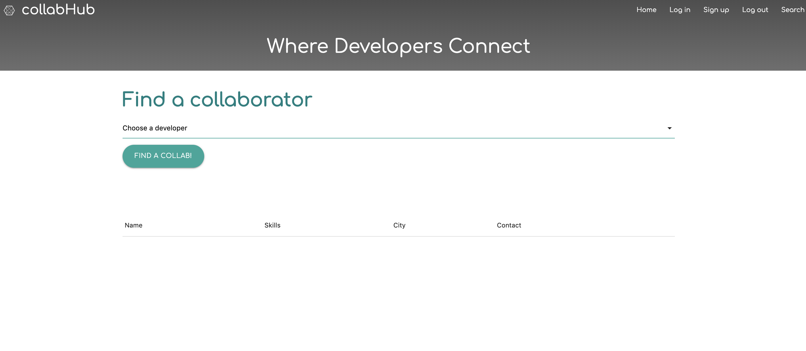
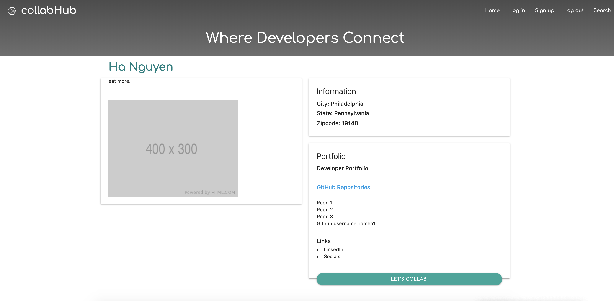

# About collabHub

This is an application that connects professionals with similar interests and skill sets so that they can work together, discover new opportunities and grow their network. 

## Descriptions:

 
 
 
 

## Link on Heroku: 
[collabHub](https://collab-hub.herokuapp.com/)

## Link on gitHub

https://github.com/iamha1/collabHub

## Installation: 
- Run `npm install` and `npm init`
- Run `dotevn`
- Run `mysql` and `mysql2`
- Run `inquirer`
- Run `express-handlebars` and `express`
- Run `sequelize` and `sequelizer`
- Run `passport` and `passport-local`
- Run `connect-flash`, `cookie-parser`

## Description:

- In this assignment, we create an application that uses Node and Express server. It is also backed up by MySQL database. We also follow the MVC design pattern; use Node and MySQL to query and route data in our application, and Handlebars to generate your HTML.
- To create our page, we use HTML and Materialize CSS.
- We also use a third-party API: 

## Create a MVC file structure: 

- 1: Config (connection.js and orm.js)
- 2: Controllers (burger_controller.js)
- 3: db (schema.sql and seeds.sql)
- 4: models (burgers.js)
- 5: node_modules
- 6: Package.json
- 7: public [assets(css and img)]
- 8: server.js
- 9: views (handlerbars)

Once the files are set up, we need to create the connection among them.

## Lisence:

MIT

## Authors:
- Amy Hollinger
- Antonio Alvarado
- Ha Nguyen
- Paul Fodrovics
